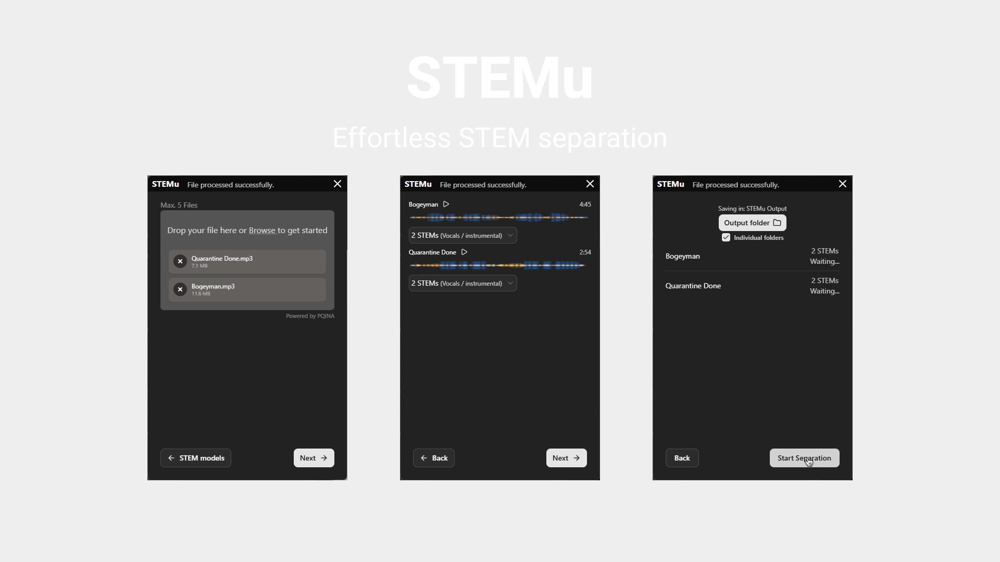
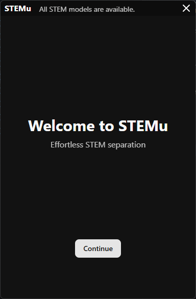
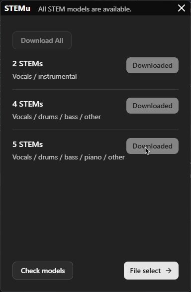
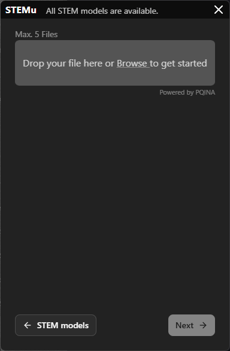
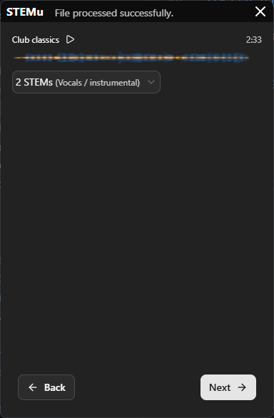
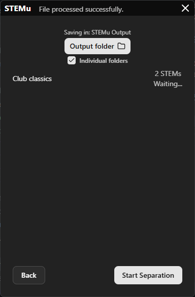

# STEMu
Separate audio files by instruments and vocals easily, with a nice UI


STEMu is a simple but complete music STEM separation and preview suite

Features:
- 1, 4, and 5 STEMs separation models from deezer
- (Coming soon) GPU and CUDA support
- Multithreaded STEM separation

# App usage
1. Welcome screen
Simply click continue and the app will begin with the process


2. Check STEM models
Go to the previous tab and check downloaded stem models:


3. File selection
Drag and drop your songs into the STEMu window or click the box to open a file picker


4. STEM model selection 
Select the STEM model you wanna use for each audio file in the next tab


5. Choose your output folder and click start separation


After a while your audio files will be in the folder you chose or in music/STEMu Output

## FFmpeg Installation Guide

To use this project, you need to have FFmpeg installed on your system. FFmpeg is a powerful multimedia framework that can decode, encode, transcode, and stream audio and video files.

### Installing FFmpeg on Windows using Winget

1. Open a terminal (PowerShell or Command Prompt).
2. Run the following command to install FFmpeg using Winget:

   ```powershell
   winget install -e --id Gyan.FFmpeg
   ```

3. Verify the installation by running:

   ```powershell
   ffmpeg -version
   ```

   If FFmpeg is installed correctly, this command will display the installed version of FFmpeg.

For more information about FFmpeg, visit the [official FFmpeg website](https://ffmpeg.org/).

